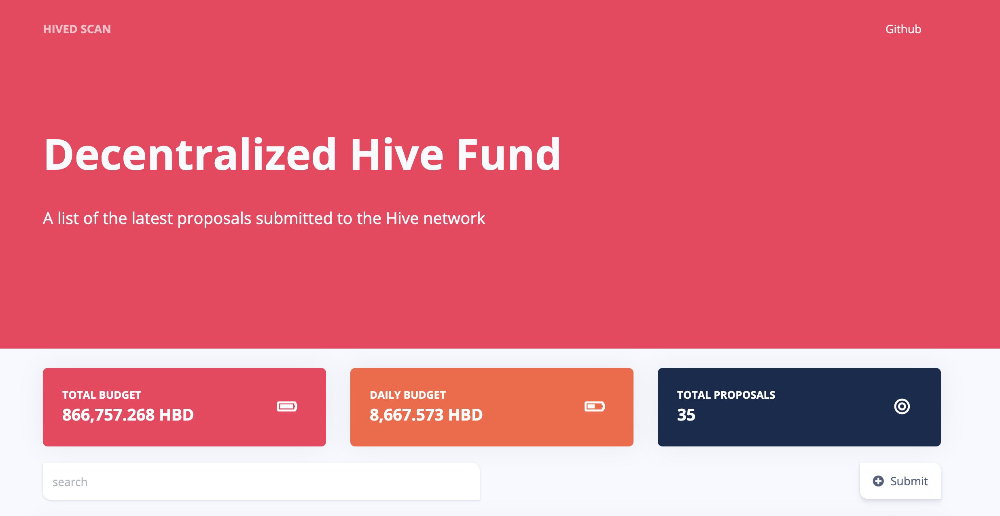
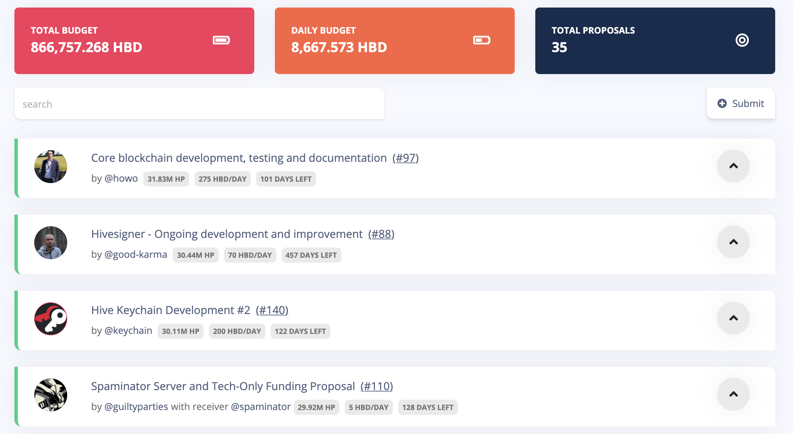
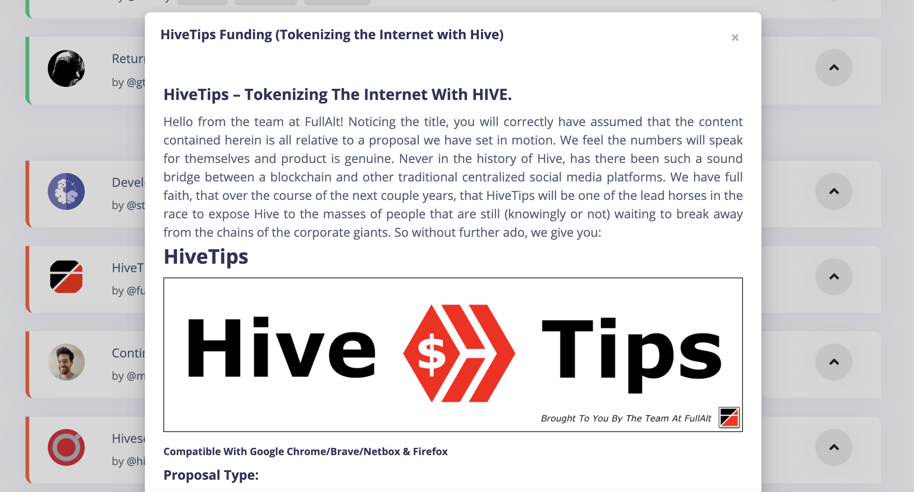

Hivedscan represents an all-in-one blockchain explorer for Hive-based dapps.

Currently, the project contains:
1. Hive DAO - a decentralized budgeting and governance system. Live
2. Hive Engine - a platform for creating tokens via smart contracts. WIP

For the actual demo, please visit https://hivedscan.com

